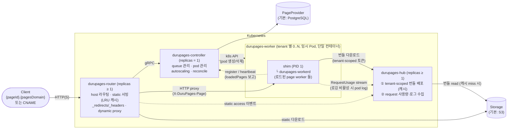
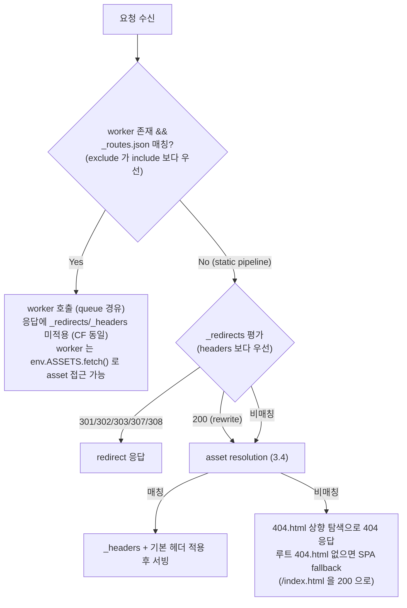
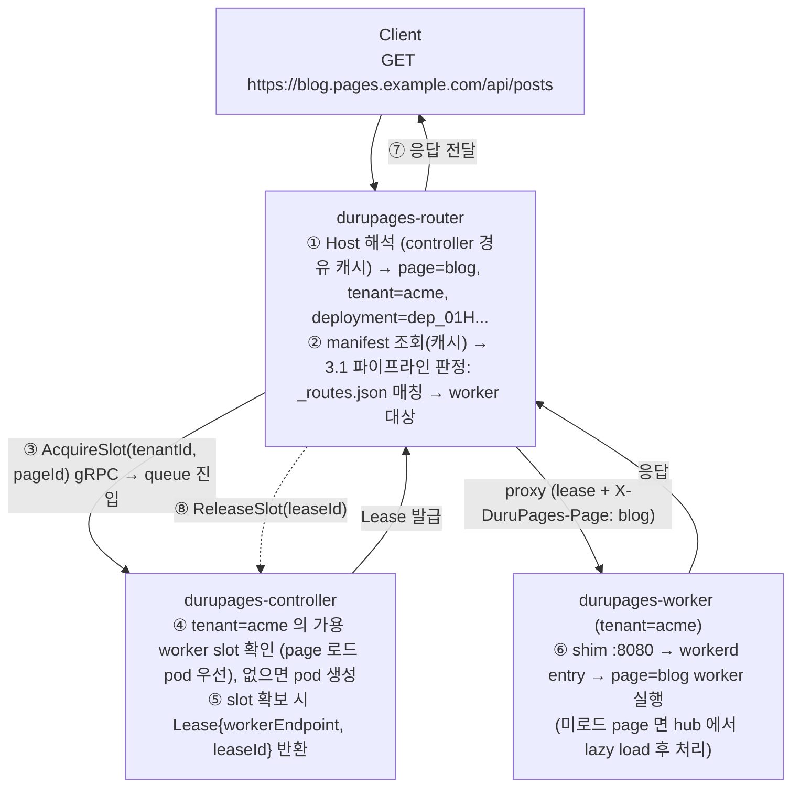
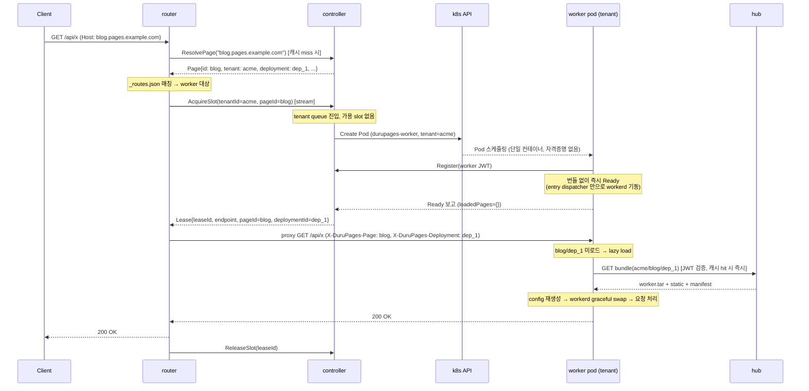
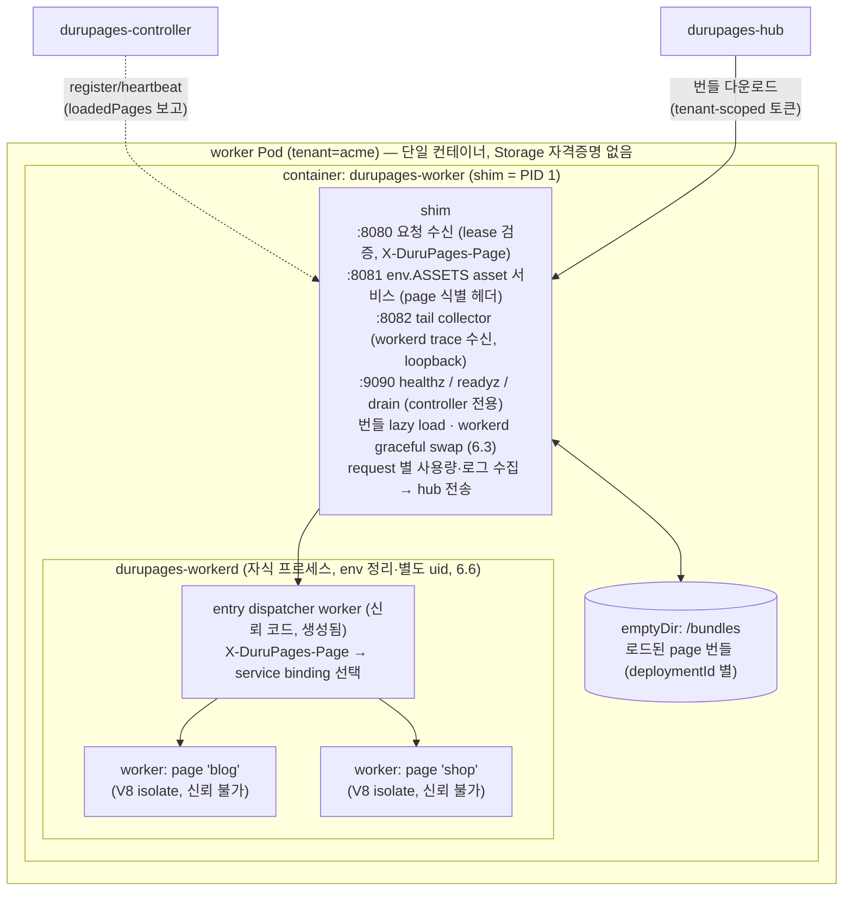
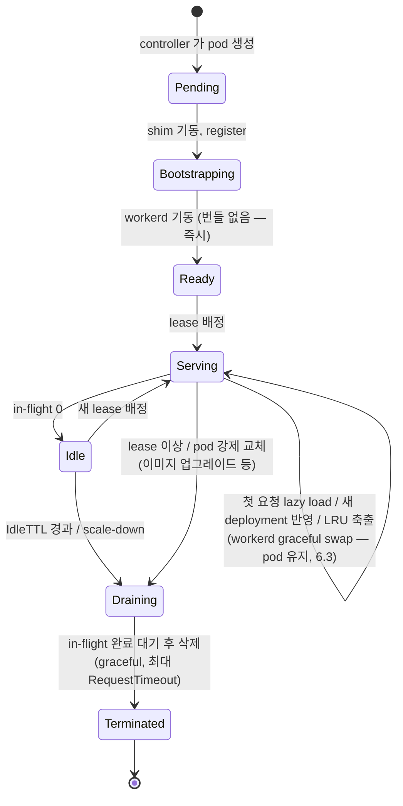
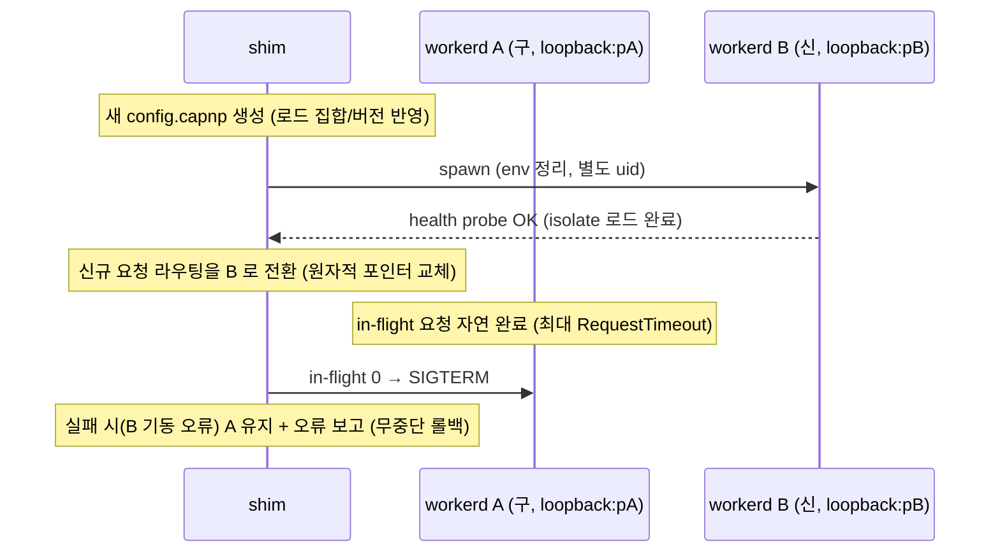
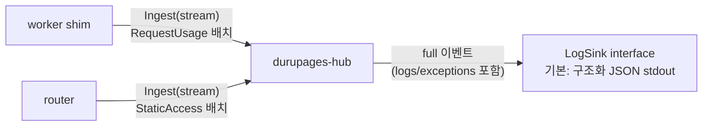

# DuruPages 아키텍처

DuruPages 는 Cloudflare Workerd 를 활용하여 Cloudflare Pages 의 기능(Static Resource serving + SSR worker)을
어디서든 self-hosting 할 수 있게 해주는 플랫폼입니다.
**wrangler 로 빌드/배포되는 Cloudflare Pages 프로젝트 구조를 그대로 사용할 수 있는 것**을 호환성 목표로 합니다.

- Worker engine: [workerd](https://github.com/cloudflare/workerd) (자체 임베더 durupages-workerd — 6.6)
- Language: Go
- Worker 구동 환경: Kubernetes
- 기본 구현체: Storage = S3, PageProvider = PostgreSQL, Queue = in-memory

핵심 실행 모델:

- **worker pod 는 page 단위가 아니라 tenant 단위**로 동작합니다. 하나의 tenant 가 소유한 page 들의
  worker 를 하나의 workerd 프로세스에 함께 올립니다 — workerd 가 한 프로세스에서 다수의
  worker(service)와 다수의 동시 요청을 처리할 수 있기 때문에 가능한 결정입니다.
  tenant 간에는 pod 를 절대 공유하지 않습니다.
- **page 번들은 항상 첫 요청 시 lazy loading** 합니다. pod 는 번들 없이 기동하고, 각 page 는
  그 page 의 첫 요청이 도달할 때 durupages-hub 에서 받아 로드합니다 (cold start 최소화).
  오래 사용되지 않은 deployment 는 LRU 로 삭제됩니다 (6.3).
- **배포는 pod 재시작 없이** 처리합니다. lease 에 담긴 최신 deploymentId 를 보고 shim 이 hub 에서
  새 번들을 받아 **workerd 프로세스만 graceful swap** 합니다 (6.3). snapshot 같은 사전 배포 목록
  동기화는 없습니다 — 모든 로드는 요청이 이끕니다.

---

## 1. 전체 구조



### 구성요소 요약

| 구성요소 | replicas | 역할 |
|---|---|---|
| durupages-controller | 1 | Control plane. 요청 queue, worker pod 생명주기 관리, autoscaling(Scaler 인터페이스 — 4.4), reconcile. 선택적으로 **admin API**(별도 포트, 14장) 제공 |
| durupages-router | >= 1 | Data plane 입구. host → page/tenant 라우팅, static resource 직접 서빙(LRU 캐시), `_redirects`/`_headers` 적용, dynamic 요청 proxy |
| durupages-hub | >= 1 | **worker 지원 서비스** (필수). ① worker pod 에 대한 **tenant-scoped 번들 배포** — Storage 자격증명은 hub 만 보유하고, pod 는 자기 tenant 의 번들만 받을 수 있음 (디스크 캐시로 cold start 가속) ② request 별 사용량·로그·예외 수집 (9장. 로깅 파이프라인은 선택 — 비활성 시 shim 이 pod log 로만 출력) |
| durupages-worker | **tenant 별** 0..N | 짧은 주기의 임시 Pod (단일 컨테이너: shim + durupages-workerd). **해당 tenant 의 page worker 들을 lazy loading 으로 실행.** 다른 tenant 로 재사용 금지 |

### 신뢰 경계 (Trust Boundary)

- controller / router / hub / worker-shim 은 **신뢰되는 코드**입니다.
- workerd 안에서 실행되는 page 의 worker 스크립트는 **신뢰할 수 없는 코드**입니다.
- **격리 단위는 tenant 입니다**: tenant 간에는 pod(프로세스·네트워크·파일시스템)가 분리됩니다.
  같은 tenant 의 page 들은 동일 신뢰 도메인(같은 소유자)이므로 하나의 workerd 프로세스를 공유하되,
  page 별로 별도 worker(= 별도 V8 isolate)로 실행됩니다.
- **worker pod 는 Storage 자격증명을 일절 갖지 않습니다.** 번들은 hub 가 pod 별 tenant-scoped 토큰을
  검증한 뒤 제공하며, Storage 자격증명은 hub(및 router)에만 존재합니다.
  (자세한 내용은 [8. 보안](#8-보안) 참조)

---

## 2. 데이터 모델

### 2.1 Tenant / Page / Deployment

- **Tenant**: 소유자(고객/조직) 단위. worker pod 의 실행·과금·격리 단위입니다.
- **Page**: 하나의 사이트. 항상 하나의 tenant 에 속합니다.
- **Deployment**: Page 의 불변(immutable) 배포 스냅샷. Page 는 하나의 "active deployment" 를 가리키며,
  배포는 새 deployment 업로드 후 포인터 교체 방식입니다 (원자적 배포, 즉시 롤백 가능).
- worker pod 가 무엇을 로드할지는 **전적으로 요청(lease)이 결정**합니다. lease 에 `{pageId,
  deploymentId}` 가 담겨 오고, shim 은 그 deployment 가 로드되어 있지 않으면 그때 hub 에서 받습니다.
  tenant 의 배포 목록을 사전 동기화(snapshot)하는 메커니즘은 없습니다 — 배포 갱신도 다음 요청의
  lease 가 새 deploymentId 를 가리키는 것으로 자연 반영됩니다 (6.3).

```go
type Tenant struct {
    ID     string
    Config TenantConfig
}

type TenantConfig struct {
    // worker pod 스케일링 (pod 는 tenant 단위이므로 여기서 관리)
    MaxConcurrency   int            // 최대 worker pod 개수 (0 이면 controller 기본값)
    IdleTTL          time.Duration  // 유휴 worker pod 유지 시간
    WorkerCPULimit   string         // pod resource limit. 예: "1"
    WorkerMemLimit   string         // 예: "512Mi"

    // worker pod metadata 에 추가되는 label/annotation.
    // (예: 모니터링 셀렉터, cost 태깅, scheduler/webhook 연동 등)
    // durupages.io/* 및 app.kubernetes.io/* 시스템 label 은 override 할 수 없습니다.
    PodLabels        map[string]string
    PodAnnotations   map[string]string
}

type Page struct {
    ID                 string        // pageId. {pageId}.{pagesDomain} 의 서브도메인으로 사용
    TenantID           string
    ActiveDeploymentID string
    CustomDomains      []string      // CNAME 목록
    Config             PageConfig
}

type PageConfig struct {
    QueueTimeout   time.Duration     // queue 대기 timeout (0 이면 controller 기본값, controller 최대값으로 clamp)
    RequestTimeout time.Duration     // worker 응답 timeout

    // Env / Secret 은 모두 해당 page worker 에 env(binding) 로 노출되며 worker 코드에서의
    // 접근 방법은 동일합니다. 차이는 로깅 처리입니다:
    //   - Secret 의 "값" 이 로그/예외/이벤트에 나타나면 shim 이 자동으로 redaction 합니다 (9.4).
    //   - 기본 PostgreSQL PageProvider 는 둘 다 config JSONB 에 저장하지만, Secret 은
    //     at-rest 암호화(pgcrypto 등)를 권장하며 조회 API 응답에서도 값을 노출하지 않습니다.
    Env            map[string]string
    Secret         map[string]string

    LogsEnabled    *bool             // hub 로의 로그 전송 여부 (nil 이면 전역 설정 따름. 9장 참조)
}

type Deployment struct {
    ID        string
    PageID    string
    CreatedAt time.Time
}
```

### 2.2 배포 번들 = wrangler 빌드 출력 디렉토리 그대로

DuruPages 의 배포 입력은 **Cloudflare Pages 에 배포하는 것과 동일한 빌드 출력 디렉토리**입니다.
wrangler(`wrangler pages deploy` 대상 디렉토리)가 만들어내는 구조를 수정 없이 업로드할 수 있어야 합니다.

```
build-output/                      # 프레임워크의 build output directory
├── index.html                     # static assets
├── assets/app.js
├── _headers                       # (선택) 커스텀 헤더 규칙
├── _redirects                     # (선택) 리다이렉트/리라이트 규칙
├── _routes.json                   # (선택) worker 호출 경로 제어
└── _worker.js                     # (선택) 단일 파일 또는 _worker.js/ 디렉토리(멀티 모듈, index.js 엔트리)
```

- `functions/` 디렉토리(파일 기반 라우팅)는 Cloudflare 와 동일하게 **배포 시점에 wrangler 로 단일
  worker 번들로 컴파일**해서 업로드합니다 (`wrangler pages functions build`). 이는 durupages 배포 CLI(추후 `duru deploy`)가
  수행하며, runtime(controller/worker)은 항상 "컴파일된 worker 번들 + static assets" 만 다룹니다.
  Cloudflare 도 동일한 방식(functions → 단일 Worker 컴파일)으로 동작하므로 호환에 문제가 없습니다.
- `_headers`, `_redirects`, `_routes.json`, `_worker.js`(디렉토리 포함) 같은 special file 은
  Cloudflare 와 동일하게 **static asset 으로 서빙되지 않습니다.**

업로드 시 durupages 는 디렉토리를 스캔하여 **파생 메타데이터인 `manifest.json`** 을 생성해 함께 저장합니다.
special file 들의 파싱·검증(문법 오류, 규칙 수 제한)은 업로드 시점에 수행되어 런타임 비용을 없앱니다.

### 2.3 Storage 레이아웃

Static Resource 와 Server Side Resource(worker 코드) 모두 Storage 에 저장됩니다.
tenant prefix 아래에 두어 hub 의 tenant-scoped 접근 검증을 단순하게 만듭니다.
deployment 는 불변이므로 캐시 무효화가 필요 없습니다.

```
tenants/{tenantId}/pages/{pageId}/deployments/{deploymentId}/manifest.json    # 파생 메타데이터
tenants/{tenantId}/pages/{pageId}/deployments/{deploymentId}/static/{sha256}  # content-addressed static 파일
tenants/{tenantId}/pages/{pageId}/deployments/{deploymentId}/worker.tar       # worker 번들 (_worker.js[/] 등)
```

`manifest.json` — router 와 worker 가 공유하는 배포 메타데이터:

```jsonc
{
  "version": 1,
  "tenantId": "acme",
  "pageId": "blog",
  "deploymentId": "dep_01H...",
  "hasWorker": true,
  "static": {
    "/index.html":      { "hash": "ab12...", "size": 1024, "contentType": "text/html" },
    "/assets/app.js":   { "hash": "cd34...", "size": 20480, "contentType": "text/javascript" }
  },
  "routes":    { "version": 1, "include": ["/*"], "exclude": ["/assets/*"] },  // _routes.json 파싱 결과
  "redirects": [ { "source": "/old/*", "destination": "/new/:splat", "status": 301 } ],  // _redirects 파싱 결과
  "headers":   [ { "pattern": "/assets/*", "set": { "Cache-Control": "max-age=31536000" }, "unset": [] } ]  // _headers 파싱 결과
}
```

### 2.4 PostgreSQL 스키마 (기본 PageProvider 구현)

```sql
CREATE TABLE tenants (
    id         TEXT PRIMARY KEY,
    config     JSONB NOT NULL DEFAULT '{}',
    created_at TIMESTAMPTZ NOT NULL DEFAULT now(),
    updated_at TIMESTAMPTZ NOT NULL DEFAULT now()
);

CREATE TABLE pages (
    id                   TEXT PRIMARY KEY,
    tenant_id            TEXT NOT NULL REFERENCES tenants(id) ON DELETE CASCADE,
    active_deployment_id TEXT,
    config               JSONB NOT NULL DEFAULT '{}',
    created_at           TIMESTAMPTZ NOT NULL DEFAULT now(),
    updated_at           TIMESTAMPTZ NOT NULL DEFAULT now()
);
CREATE INDEX pages_tenant_idx ON pages(tenant_id);

CREATE TABLE deployments (
    id         TEXT PRIMARY KEY,
    page_id    TEXT NOT NULL REFERENCES pages(id) ON DELETE CASCADE,
    created_at TIMESTAMPTZ NOT NULL DEFAULT now()
);

CREATE TABLE custom_domains (
    domain  TEXT PRIMARY KEY,        -- CNAME 대상 도메인
    page_id TEXT NOT NULL REFERENCES pages(id) ON DELETE CASCADE
);
```

---

## 3. Cloudflare Pages 호환성

Cloudflare 공식 문서 기준으로 다음 스펙을 구현합니다.
(참고: [Functions routing](https://developers.cloudflare.com/pages/functions/routing/),
[Redirects](https://developers.cloudflare.com/pages/configuration/redirects/),
[Headers](https://developers.cloudflare.com/pages/configuration/headers/),
[Advanced mode](https://developers.cloudflare.com/pages/functions/advanced-mode/),
[Serving Pages](https://developers.cloudflare.com/pages/configuration/serving-pages/))

### 3.1 요청 라우팅 파이프라인 (Cloudflare 와 동일한 우선순위)



- worker 가 없는 순수 static 프로젝트면 항상 2번 파이프라인입니다.
- worker 가 있고 `_routes.json` 이 없으면 CF 와 동일하게 **모든 경로가 worker 를 호출**합니다
  (`include: ["/*"]` 취급). static 경로를 exclude 하는 것은 사용자의 `_routes.json` 몫입니다.
  (functions 빌드를 쓰는 경우 wrangler 가 `_routes.json` 을 자동 생성해 줄 수 있음)

### 3.2 `_routes.json`

- 스키마: `{ "version": 1, "include": [...], "exclude": [...] }`
- **exclude 가 include 보다 우선**합니다.
- wildcard `*` 는 slash 를 포함해 임의 개수의 path segment 를 매칭합니다 (`/users/*` 는 `/users/` 이하 전부).
- 제한: include 최소 1개, include+exclude 합산 최대 100개, 규칙당 최대 100자. 업로드 시 검증.

### 3.3 `_redirects`

- 한 줄 형식: `[source] [destination] [status?]` (status 생략 시 302). 지원 status: 301, 302, 303, 307, 308,
  그리고 **200 (내부 경로 한정 proxy/rewrite — 응답 URL 변경 없이 destination 의 asset 을 서빙)**.
- splat `*`(1개만, greedy, `:splat` 으로 참조), placeholder `:name`(`/`·`.` 제외 문자 매칭) 지원.
- 상단 규칙 우선 (동일 source 에 여러 규칙이 있으면 첫 번째 적용).
- `#` 주석 지원.
- 제한: static 2,000개 + dynamic 100개 (합 2,100), 규칙당 1,000자. 업로드 시 검증.
- **worker 로 라우팅된 요청에는 적용되지 않습니다** (CF 동일 — worker 가 우선).

### 3.4 Static asset resolution (Serving Pages 동작)

- 확장자 없는 URL 우선(pretty URL): `/contact.html` 요청 → `/contact` 로 redirect,
  `/about/index.html` → `/about/` 로 redirect. `/contact` 요청은 `contact.html` 을,
  `/about/` 은 `/about/index.html` 을 서빙.
- `ETag: "{hash}"` 제공, `If-None-Match` 매칭 시 `304 Not Modified`.
- 404: 요청 경로에서 **상위 디렉토리로 올라가며 가장 가까운 `404.html`** 을 찾아 404 status 로 서빙
  (`/blog/404.html` 같은 디렉토리별 404 페이지 지원).
- **SPA fallback**: 루트 `404.html` 이 없으면 SPA 로 간주, 매칭되지 않는 모든 경로에
  `/index.html` 을 `200` 으로 서빙.
- 기본 헤더 호환: `Access-Control-Allow-Origin: *`, `Referrer-Policy: strict-origin-when-cross-origin`,
  `X-Content-Type-Options: nosniff`, `Cache-Control: public, max-age=0, must-revalidate` 를
  기본 부여 (`_headers` 의 `! 헤더명` 문법으로 제거 가능).

### 3.5 `_headers`

- 형식: URL 패턴 한 줄 + 들여쓰기된 `Header-Name: value` 줄들. `#` 주석.
- splat(패턴당 1개)·placeholder 지원, 헤더 값에서 `:splat`/`:name` 참조 가능.
- `https://` 로 시작하는 절대 URL 패턴 지원 (host 매칭 — 커스텀 도메인별 헤더).
- `! Header-Name` 으로 기본/상속 헤더 제거.
- 여러 규칙이 매칭되면 **누적** 적용, 같은 이름은 comma 로 join.
- redirect 가 매칭된 요청에는 적용되지 않음 (redirect 우선).
- **worker(Functions) 응답에는 적용되지 않음** (CF 동일).
- 제한: 최대 100 규칙, 줄당 2,000자. 업로드 시 검증.

### 3.6 Worker (`_worker.js`, advanced mode) 와 `env.ASSETS`

- `_worker.js` 단일 파일 또는 `_worker.js/` 디렉토리(ESM 멀티 모듈, `index.js` 엔트리)를 지원합니다.
  Module Worker 문법(`export default { fetch }`) 필수. wasm/text/binary 모듈 import 지원 (workerd 기능 그대로).
- `_worker.js` 가 있으면 `functions/` 는 무시됩니다 (CF 동일).
- **`env.ASSETS` binding**: worker 코드에서 `env.ASSETS.fetch(request)` 로 static asset 을 가져올 수
  있어야 합니다. 구현: workerd config 에서 **page 별 worker 각각에** `ASSETS` 를 external HTTP 서비스로
  선언하고, 같은 pod 의 **shim 이 page 식별 헤더 기반 asset endpoint 를 제공**합니다. shim 은 로드한
  page 번들의 static 파일 전체와 manifest 를 갖고 있으므로 3.4 의 resolution 규칙(공용 패키지
  `pkg/assets`)을 로컬에서 그대로 수행합니다.
  → router 의 static 서빙과 worker 내 `ASSETS` 가 동일한 코드 경로를 공유해 동작 일치를 보장.
- `nodejs_compat` 등 compatibility flags / compatibility date 는 page 의 wrangler 설정
  (`wrangler.toml` 의 `compatibility_date`, `compatibility_flags`)을 업로드 시 수집해
  workerd config 생성에 반영합니다. **page 별 worker 는 각자의 compatibility 설정을 가집니다**
  (workerd 는 service 단위로 설정 가능).

### 3.7 호환 범위 밖 (명시적 비목표)

- KV / D1 / R2 / Durable Objects 등 Cloudflare 리소스 binding — 초기 버전 비지원.
  (workerd 의 binding 체계 위에 확장 가능하도록 workerd config 생성부를 모듈화해 둠)
- Preview deployment / branch alias, Web Analytics, Access 연동 등 플랫폼 부가 기능.

---

## 4. 확장 인터페이스

DuruPages 는 특정 인프라·정책에 종속되지 않도록 네 가지 교체 지점을 Go interface 로 둡니다:
**Storage**(기본 S3), **PageProvider**(기본 PostgreSQL), **Queue**(기본 in-memory),
**Scaler**(기본 target/max concurrency 알고리즘).
controller/router/hub 는 모두 라이브러리로 제공되어 커스텀 바이너리로 조립할 수 있습니다.

### 4.1 Storage

```go
// package storage
type Storage interface {
    Get(ctx context.Context, key string) (io.ReadCloser, ObjectInfo, error)
    Put(ctx context.Context, key string, r io.Reader, size int64, contentType string) error
    Delete(ctx context.Context, key string) error
    List(ctx context.Context, prefix string) ([]ObjectInfo, error)
}

type ObjectInfo struct {
    Key         string
    Size        int64
    ETag        string
    ContentType string
}
```

- 기본 구현: S3 (AWS SDK, MinIO 호환).
- **Storage 에 접근하는 곳은 router / hub / 배포 CLI(duru) 뿐이며, 모두 이 interface 를 통해서만
  접근**합니다. worker pod 는 hub 를 경유합니다 (자격증명 미보유).
  커스텀 Storage 는 각 바이너리에 자신의 구현을 링크해 조립합니다.
- 예외: controller 는 **admin API 를 활성화한 경우에만** Storage 를 사용합니다 (업로드된 배포를
  기록하기 위해). control plane 경로(queue/lease/scaling)는 Storage 를 전혀 건드리지 않습니다 (14장).

### 4.2 PageProvider

DB 에 종속되지 않기 위한 인터페이스이며, 동시에 **controller 커스터마이징 지점**입니다.
기본 구현은 PostgreSQL 이고, 운영자는 자체 PageProvider 를 구현하여 과금 시스템 연동,
동적 설정, 커스텀 도메인 검증 등을 붙일 수 있습니다.

```go
// package provider
type PageProvider interface {
    // 라우팅
    ResolvePage(ctx context.Context, host string) (*Page, error)    // {pageId}.{pagesDomain} 또는 CNAME → Page (TenantID 포함)
    GetPage(ctx context.Context, pageID string) (*Page, error)
    GetTenant(ctx context.Context, tenantID string) (*Tenant, error)
}

// 선택적 확장: 구현하면 controller 가 tenant/page 변경을 push 로 감지 (미구현 시 TTL 기반 polling)
type PageWatcher interface {
    Watch(ctx context.Context) (<-chan PageEvent, error)
}

// 선택적 확장: worker pod 스펙 후킹 (커스터마이징 용)
type PodMutator interface {
    MutateWorkerPod(ctx context.Context, tenant *Tenant, pod *corev1.Pod) error
}
```

### 4.3 Queue

queue 도 교체 가능한 interface 입니다. **기본 구현은 in-memory** 이며(controller replicas=1 전제),
본 프로젝트에서 구현하지는 않지만 예를 들어 Redis(BLPOP/stream) 기반 구현으로 교체하면
controller 재시작 시 대기 요청을 보존하거나, 향후 controller HA 구성의 기반으로 삼을 수 있습니다.

```go
// package queue
type Queue interface {
    // Enqueue 는 요청을 tenant 별 대기열에 넣습니다. ctx 에는 queue timeout(요청 대상 page 의 설정)이
    // 걸려 있으며, ctx 취소(요청자 이탈/타임아웃) 시 대기 항목은 제거되어야 합니다.
    Enqueue(ctx context.Context, tenantID string, item Item) (Ticket, error)

    // Dequeue 는 대기열의 다음 항목을 꺼냅니다. slot 이 확보되었을 때 dispatcher 가 호출합니다.
    // 대기 항목이 없으면 block 하다가 ctx 취소 시 반환합니다.
    Dequeue(ctx context.Context, tenantID string) (Item, error)

    // Depth 는 autoscaler 가 사용하는 현재 대기열 길이입니다.
    Depth(ctx context.Context, tenantID string) (int, error)
}

// Ticket 은 대기 상태 조회/취소 핸들, Item 은 {itemID, pageId, enqueuedAt, deadline, 메타데이터} 입니다.
```

- queue 는 "대기 순서" 만 책임집니다. slot/lease 관리, timeout 판단, autoscaling 은
  queue 구현과 무관하게 controller 의 dispatcher 가 수행합니다 — 구현체가 갖춰야 할 계약을 최소화하기 위함입니다.
- timeout 동작(만료 시 429)과 순서 보장(FIFO)은 구현체 계약으로 문서화하고 공용 conformance test 를 제공합니다.

### 4.4 Scaler

scale up/down 판단도 교체 가능한 interface 입니다. **기본 구현은 6.4 의 알고리즘**
(target/max concurrency 기반)이며, 예측 기반·시간대 기반·비용 최적화 등 커스텀 정책으로 교체할 수 있습니다.

```go
// package scaler
type Scaler interface {
    // DesiredPods 는 scale-up 판단입니다. 수요 변화 시점(요청 enqueue 등)마다 호출되며,
    // 현재 상태를 보고 tenant 가 가져야 할 pod 수를 반환합니다.
    // 반환값 > (ready + creating) 이면 controller 가 부족분을 생성합니다.
    DesiredPods(ctx context.Context, s TenantScaleState) int

    // SelectScaleDown 은 scale-down 판단입니다. 주기 루프(기본 30초)에서 호출되며,
    // 지금 drain·종료해도 되는 pod 목록을 반환합니다 (빈 목록 = 유지).
    SelectScaleDown(ctx context.Context, s TenantScaleState) []PodRef
}

type TenantScaleState struct {
    Tenant       *provider.Tenant
    InFlight     int          // tenant 전체 in-flight
    QueueDepth   int          // Queue.Depth()
    ReadyPods    []PodState   // pod 별 {ref, inFlight, idleSince, loadedPages}
    CreatingPods []PodRef     // Pending/Bootstrapping
    Defaults     ScaleDefaults // targetConcurrencyPerPod, maxConcurrencyPerPod, MaxConcurrency 등
}
```

- scale-up 경로는 요청 처리의 hot path 이므로 `DesiredPods` 는 빠르게(수 µs) 반환해야 합니다.
  외부 신호가 필요한 구현은 내부 캐시를 사용해야 합니다 (계약으로 문서화).
- `MaxConcurrency`(tenant 최대 pod 수) clamp 는 Scaler 반환값에 대해 controller 가 최종 강제합니다 —
  커스텀 구현이 상한을 어길 수 없습니다.

### 4.5 Runtime

추후 workerd 가 아닌 다른 runtime(부록 A 참조)으로 교체할 수 있도록, shim 은 runtime 을
직접 다루지 않고 **`Runtime` 인터페이스**를 통해서만 다룹니다. lazy load·graceful swap·LRU 축출은
모두 이 인터페이스 위에서 runtime 중립적으로 구현됩니다.

```go
// package runtime
type Runtime interface {
    // Launch 는 로드 집합으로 새 인스턴스를 기동합니다 (blue-green swap 의 "green").
    Launch(ctx context.Context, spec InstanceSpec) (Instance, error)
}

type Instance interface {
    Endpoint() string             // 요청 proxy 대상 (loopback)
    WaitReady(ctx context.Context) error
    Drain(ctx context.Context) error // shim 이 라우팅 전환 후 in-flight 완료 대기
    Close() error
}

type InstanceSpec struct {
    Pages []PageWorker // {pageId, deploymentId, bundleDir, compat 설정, Env/Secret, ASSETS/tail endpoint}
}

// 선택적 확장: 구현하면 요청별 CPU 시간 등 계측을 runtime 이 제공 (workerd 구현은 tail 스트림 사용)
type MetricsSource interface {
    Events() <-chan RequestTrace  // logs, exceptions, cpuTime, event 메타
}
```

- 기본 구현 `pkg/runtime/workerdruntime`: config.capnp 와 entry dispatcher worker 생성,
  durupages-workerd 프로세스 spawn(env 정리·별도 uid), tail collector 로 `MetricsSource` 제공.
- 요청 라우팅 헤더(`X-DuruPages-Page`), 번들 디렉토리 구조, 사용량 이벤트 스키마는 runtime 중립
  계약으로 고정되어 있어, 새 runtime 은 이 인터페이스만 구현하면 됩니다.

### 4.6 커스텀 조립 예시

```go
func main() {
    ctrl := controller.New(controller.Options{
        Provider: mycompany.NewBillingPageProvider(...), // 커스텀 PageProvider
        Storage:  s3storage.New(...),
        Queue:    redisqueue.New(...),                   // 커스텀 Queue (예시)
        Scaler:   mycompany.NewPredictiveScaler(...),    // 커스텀 Scaler (생략 시 기본 알고리즘)
    })
    ctrl.Run(ctx)
}
```

---

## 5. 요청 처리 흐름

### 5.1 Inbound 개요



### 5.2 Static 요청 처리 (router 단독)

static pipeline(3.1 의 2번 경로)은 queue 를 거치지 않고 router 가 즉시 처리합니다.

1. Host → Page 해석 (router 로컬 캐시, miss 시 controller `ResolvePage` RPC)
2. active deployment 의 `manifest.json` 조회 (router 로컬 캐시; deployment 는 불변이므로 deploymentId 키로 영구 캐시 가능)
3. `_redirects` 평가 → redirect 응답 또는 rewrite 된 경로로 계속
4. asset resolution (3.4) 으로 대상 파일 hash 결정:
   - **로컬 LRU 캐시** (`{cacheDir}/{sha256-hash}`) 에 있으면 파일에서 바로 서빙
   - 없으면 Storage 에서 `static/{hash}` 다운로드 → LRU 캐시에 저장 후 서빙
5. `_headers` + 기본 헤더 적용, `ETag`/`If-None-Match` 로 304 처리

**LRU 캐시 설계:**
- 위치: 임시 파일시스템 (`emptyDir` 또는 로컬 디스크), 파일명은 content hash → deployment 간 중복 제거 자동 달성
- 최대 용량 지정 가능 (`--static-cache-max-bytes`, 기본 1GiB). 초과 시 LRU 순으로 eviction
- in-memory 인덱스(hash → size, atime) + 디스크 파일. router 재시작 시 캐시 디렉토리 스캔으로 인덱스 재구성 (실패 시 비우고 시작)
- 동일 hash 동시 다운로드는 singleflight 로 병합

### 5.3 Dynamic 요청 처리 (queue + worker)

**Queue 흐름 (controller 내부, tenant 단위):**

- router 의 `AcquireSlot(tenantId, pageId)` 은 server-streaming gRPC 로, slot 배정까지 대기하다 배정되면
  lease 를 수신합니다. stream 이 끊기면(클라이언트 이탈) controller 는 Enqueue ctx 를 취소해 대기 항목을 제거합니다.
- controller dispatcher 는 tenant 별로 `Queue.Dequeue` ↔ 가용 slot 을 짝지어 lease 를 발급합니다.
- **Queue timeout 은 page 단위**: enqueue 시점에 요청 대상 page 의
  `min(page.QueueTimeout || defaultQueueTimeout, maxQueueTimeout)` 적용.
  초과 시 router 에 timeout 이벤트 → client 에 `429 Too Many Requests` (+ `Retry-After`).
- (보호장치) tenant 별 최대 queue 길이 초과 시 즉시 429.

**Slot / Lease:**

- 하나의 worker pod 는 최대 `maxConcurrencyPerPod`(기본 256, controller 설정) 개의 요청을 동시 수용합니다 —
  workerd 는 단일 프로세스로 다수 요청을 동시 처리할 수 있으므로 이를 최대한 활용합니다.
  scale-up 판단 기준은 이보다 훨씬 낮은 `targetConcurrencyPerPod` 입니다 (6.4 참조).
- slot 은 tenant 의 pod pool 이 공유합니다 — 같은 pod 이 동시에 여러 page 의 요청을 처리할 수 있습니다.
  lease 배정은 **요청 대상 page 를 이미 로드한 pod 를 우선**합니다 (lazy load 지연 회피, 6.3).
- lease 는 `{leaseId, workerEndpoint, pageId, deploymentId, deadline}` 입니다. deploymentId 는
  lease 발급 시점의 active deployment 로, shim 의 lazy load / 배포 반영(6.3)의 유일한 기준이 됩니다.
  deadline 은 요청 대상 page 의 `RequestTimeout` 기반.
- router 가 `ReleaseSlot` 을 보내지 못하고 죽어도, controller 는 lease deadline 경과 시 slot 을 회수합니다.
  이때 해당 worker 의 상태를 신뢰할 수 없으므로 worker 를 drain 후 교체합니다.

### 5.4 시퀀스 다이어그램 (dynamic, cold start 포함)



pod 는 **번들 없이 기동해 즉시 Ready** 가 되고, 모든 page 는 **그 page 의 첫 요청에서 lazy load**
됩니다 (hub 디스크 캐시 hit 시 다운로드는 수 ms). 같은 page 의 이후 요청은 로드된 worker 가 바로
처리하며, controller 의 "page 로드 pod 우선" 배정이 lazy load 발생 빈도를 최소화합니다.

---

## 6. durupages-worker 상세

### 6.1 Pod 구성 (tenant 단위, 단일 컨테이너)

worker pod 는 controller 가 직접 생성하는 bare Pod 이며 (Deployment/ReplicaSet 미사용 — 개별 생명주기 제어를 위해),
다음 라벨을 가집니다:

```yaml
labels:
  app.kubernetes.io/name: durupages-worker
  durupages.io/tenant-id: "acme"
  durupages.io/controller-generation: "abcd1234"   # reconcile 용
  # + tenant.Config.PodLabels
annotations: {}                                    # + tenant.Config.PodAnnotations
```

pod metadata 는 다음 순서로 병합됩니다 (뒤가 우선):

1. `TenantConfig.PodLabels` / `PodAnnotations` — tenant 별 커스텀 metadata
2. 시스템 label (`durupages.io/*`, `app.kubernetes.io/*`) — **항상 시스템 값이 우선** (reconcile
   과 재사용 금지 검증의 근거이므로 tenant 설정으로 override 불가. 충돌 키는 설정 검증 시 거부)
3. (선택) `PodMutator` 확장 — 신뢰되는 운영자 코드이므로 pod spec 전체를 수정 가능



- **initContainer(helper)는 없습니다.** shim 은 기동 직후 controller 에 register 하고
  **번들 없이(entry dispatcher 만으로) workerd 를 띄워 즉시 Ready** 가 됩니다.
  page 번들은 항상 그 page 의 첫 요청(lease)에서 hub 로부터 lazy load 됩니다 (6.3).
- pod 에는 **어떤 k8s Secret 도 마운트되지 않습니다.** hub 인증은 controller 가 pod 생성 시 env 로
  주입하는 **tenant-scoped 단기 JWT** 로 하며 (7장), hub 는 서명 검증 후
  **JWT 의 tenant claim 과 요청 경로의 tenantId 가 일치할 때만** 번들을 제공합니다.
- shim 은 workerd 를 **env 를 비우고 별도 uid** 로 spawn 합니다 — 신뢰 불가 코드가 같은 컨테이너의
  토큰(shim 메모리/0600 파일)에 접근할 수 없게 하기 위함입니다.
- workerd config(`config.capnp`) 와 entry dispatcher worker 는 shim 이 로드된 page 집합으로부터 생성합니다
  (page 별 worker + 각자의 compatibility 설정/`Env`·`Secret` binding/ASSETS/tails).
  `Env` 와 `Secret` 은 worker 코드에서 동일하게 env binding 으로 접근하며, 차이는 로깅 시
  Secret 값의 자동 redaction 뿐입니다 (9.4).
- 순수 static page(worker 없음)는 worker 경로로 lease 가 발급되지 않으므로 로드 대상이 아닙니다.
- shim 은 controller heartbeat 이 5분간 없으면 self-terminate 합니다 (고아 pod 방지).

### 6.2 생명주기



- **생성**: controller 가 tenant queue 수요를 보고 생성. shim 이 register 를 마치고 초기 page 를 로드해야
  트래픽 배정 대상이 됩니다.
- **재사용 금지**: pod 는 생성 시점의 tenant 에 영구 고정입니다 (라벨 + 토큰 + shim 상태 3중).
  **다른 tenant 로의 재사용은 어떤 경우에도 없습니다.** 단, 같은 tenant 안에서의 deployment 갱신은
  pod 교체가 아니라 hot update 로 처리합니다 (6.3).
- **종료**: `IdleTTL` 동안 요청이 없으면 controller 가 drain → 삭제. drain 은 shim 의 `/drain` 호출로
  신규 lease 차단 후 in-flight 완료를 기다립니다 (graceful, 최대 `RequestTimeout`).
  pod 교체가 필요한 경우는 worker 이미지 업그레이드, 상태 이상(lease 만료·healthz 실패) 등으로 한정됩니다.

### 6.3 Lazy loading · 무중단 deployment 반영 · LRU 축출

worker pod 는 어떤 page 도 미리 받지 않습니다. **로드는 전적으로 lease 가 이끕니다** — lease 에 담긴
`{pageId, deploymentId}` 와 shim 의 현재 로드 집합을 비교해 필요할 때만 받습니다. 모든 로드 집합 변경은
**workerd 프로세스만 교체(graceful swap)** 하며, pod 는 유지됩니다.

```
요청(lease) 수신 시 shim 의 판단:
    loaded[pageId] == lease.deploymentId  → 그대로 처리 (대부분의 요청. lastUsed 갱신)
    loaded[pageId] 가 다른 deployment    → 새 deployment 를 hub 에서 받아 swap 후 처리 (= 배포 반영)
    loaded[pageId] 없음                  → 해당 번들을 hub 에서 받아 swap 후 처리 (= 첫 요청 lazy load)
```

- **첫 요청 lazy load**: hub 디스크 캐시 hit 시 다운로드는 보통 수십 ms 입니다. controller 가
  lease 배정 시 "page 를 이미 로드한 pod 우선" 정책을 쓰므로, lazy load 는 그 page 의 첫 요청
  경로에서만 발생합니다.
- **배포 반영에 별도 동기화가 없습니다**: controller 는 lease 발급 시점의 active deploymentId 를
  lease 에 담을 뿐이고, shim 은 lease 와 로드 집합의 불일치를 보고 스스로 갱신합니다.
  배포 직후의 in-flight 요청은 구 deployment 에서 자연 완료됩니다 (graceful swap 의 drain).

**Deployment LRU 축출** — 오래 사용되지 않은 deployment 는 삭제합니다:

- shim 은 로드된 deployment 마다 `lastUsed`(마지막 요청 시각)를 추적합니다.
- 다음 두 조건을 **모두** 만족할 때만 축출 대상입니다:
  1. LRU 순서 — 가장 오래 사용되지 않은 것부터
  2. **최소 idle 시간 경과** — `lastUsed` 로부터 `DURUPAGES_BUNDLE_MIN_IDLE` (env, 기본 `1h`) 이상
     사용되지 않았을 것. 이 하한 미만인 deployment 는 디스크가 부족해도 지우지 않습니다.
- 축출 트리거: 주기 sweep (기본 5분) + 디스크 사용량이 `DURUPAGES_BUNDLE_CACHE_MAX_BYTES`
  (env, 기본 2GiB) 를 초과한 경우.
- 축출 = 로드 집합에서 제거(다음 graceful swap 에 반영 — 축출만을 위한 즉시 swap 은 디스크 압박이
  있을 때만 수행) + 번들 파일 삭제. 축출된 page 에 다시 요청이 오면 일반 lazy load 로 재로드됩니다.
- 같은 page 의 구버전 deployment (배포 반영 후 남은 것)도 동일 메커니즘으로 정리됩니다 —
  swap 직후에는 drain 중일 수 있으므로 즉시 지우지 않고 LRU + min idle 규칙을 따릅니다.
- worker env 는 controller 가 pod 생성 시 주입하며 (10장 worker 설정), `PodMutator` 로 tenant 별
  조정도 가능합니다.

**Graceful swap (workerd blue-green):**



- deployment 불변성 덕분에 A/B 는 서로 다른 번들 디렉토리(`/bundles/{deploymentId}`)를 참조하므로
  파일 충돌이 없습니다. swap 후 참조되지 않는 구 번들은 shim 이 지연 삭제합니다.
- 짧은 시간 A/B 두 프로세스가 공존하므로 pod 메모리 limit 은 이를 감안해 산정합니다
  (isolate 는 B 에서 요청이 처음 도달할 때 lazy 하게 초기화되어 피크가 완화됨).
- workerd 의 dynamic worker loading(실험 기능)이 안정화되면 swap 없이 프로세스 내 로드로
  대체하는 것을 future work 로 둡니다 (부록 A 참조).

### 6.4 Auto Scaling (tenant 단위)

scale up/down 판단은 **`Scaler` 인터페이스**(4.4)를 통해 이루어지며, 이 절은 **기본 구현**의
알고리즘입니다. 호출 시점은 구현과 무관하게 고정입니다: **scale-up 판단(`DesiredPods`)은 주기 실행이
아니라 요청 수신 시점(모든 `AcquireSlot` enqueue)마다 동기적으로**, scale-down 판단(`SelectScaleDown`)은
주기 루프(기본 30초)에서 수행됩니다.

workerd 는 단일 프로세스로 다수 요청을 동시 처리할 수 있으므로 이를 최대한 활용하되,
기본 구현은 두 개의 동시성 파라미터를 구분합니다:

| 파라미터 | 기본값 | 의미 |
|---|---|---|
| `maxConcurrencyPerPod` | 256 | pod 하나가 동시에 수용하는 요청 수의 **hard cap** (admission 상한). 새 pod 이 뜨는 동안 기존 pod 이 burst 를 흡수하는 여유분 |
| `targetConcurrencyPerPod` | 32 | scale-up 을 촉발하는 pod 당 **목표 동시성** (soft). 정상 상태에서 pod 당 부하가 이 수준으로 수렴하도록 pod 수를 결정 |

```
요청 enqueue 시 (dispatcher, 동기, tenant 단위):
    # 1) 배정 — cold start 를 기다리지 않음
    Ready pod 중 in-flight < maxConcurrencyPerPod 인 pod 이 있으면
        → 대상 page 를 로드한 pod 중 least-loaded 우선,
          없으면 임의 pod 에 배정 (shim 이 lazy load 후 처리)
    없으면 → queue 대기 (모든 pod 이 hard cap 도달 상태에서만 발생)

    # 2) scale 판단 — 배정 여부와 무관하게 매 요청 수행
    demand    = inFlight + queueDepth + 1
    desired   = clamp(ceil(demand / targetConcurrencyPerPod),
                      1, tenant.MaxConcurrency || defaultMaxConcurrency)
    effective = readyPods + creatingPods        # 생성 중(Pending/Bootstrapping) 포함
    if desired > effective → 부족분 즉시 병렬 생성
```

동작 특성:

- **burst 흡수**: 요청이 몰리면 기존 pod 이 target(32)을 초과해 hard cap(256)까지 즉시 수용하므로
  cold start 를 기다리며 대기하는 요청이 최소화됩니다. 동시에 scale 판단은 target 기준으로 이미
  pod 생성을 시작했으므로, 새 pod 이 Ready 되면 least-loaded 배정에 의해 부하가 자연스럽게 분산됩니다.
- **수렴**: 수요가 지속되면 pod 당 in-flight 가 `targetConcurrencyPerPod` 근처로 수렴하고,
  수요가 빠지면 여분 pod 이 idle 이 되어 scale-down 대상이 됩니다.
- **tenant 단위의 이점**: 한 tenant 의 여러 page 가 pod pool 을 공유하므로, page 별로 pod 를 두는
  방식보다 pod 수와 cold start 빈도가 크게 줄어듭니다 (page 수가 많고 각각 트래픽이 적은 전형적
  워크로드에서 특히 유효).
- **중복 생성 방지**: 생성 중 pod 을 `effective` 에 포함하므로 cold start 동안 요청이 몰려도
  필요 이상으로 pod 를 만들지 않습니다.
- **Scale-down**: 기본 구현의 `SelectScaleDown` 은 idle pod 가 `IdleTTL` 을 넘겼을 때만 반환합니다
  (플래핑 방지). 주기 루프는 이벤트 누락 대비 drift 보정(실제 pod 수 ↔ 기대 상태 대조)도 겸합니다.
- `MaxConcurrency` 는 **tenant 의 최대 pod 개수**입니다 (실질 최대 동시 처리량은
  `MaxConcurrency × maxConcurrencyPerPod`). 상한 도달 상태에서 queue 가 timeout 나면 429 로 응답됩니다.
- queueDepth 는 `Queue.Depth()` 로 조회하므로 커스텀 queue 구현에서도 동일하게 동작합니다.

### 6.5 Controller 재시작 시 Reconcile

controller 는 상태의 원천을 "k8s 의 실제 pod 목록 + shim 의 자기 보고"로 두어, 재시작 후에도 쓰레기 worker 없이 복구됩니다.

1. 기동 시 `app.kubernetes.io/name=durupages-worker` 라벨로 전체 pod list
2. 각 pod 에 대해 shim `/healthz` 로 검사: `{tenantId, loadedPages, state, inFlight}` 응답 대조
   - 정상 + tenant 일치 → **adopt** (slot pool 에 편입). 로드된 deployment 가 구버전이어도 문제 없음 —
     다음 lease 의 deploymentId 로 자연 갱신됩니다 (6.3)
   - 응답 없음 / 상태 이상 / 미지의 pod / tenant 불일치 → 삭제
3. 기본 in-memory queue 는 재시작 시 유실됩니다. 대기 중이던 router 의 `AcquireSlot` stream 은 끊기며,
   router 는 이를 감지해 재연결 후 재-enqueue 하거나(멱등 GET 등) client 에 503 을 반환합니다.
   (외부화된 Queue 구현을 쓰면 대기 항목이 보존되어 재연결 후 이어집니다)
4. 보조 안전장치: shim 은 controller heartbeat 부재 5분 후 self-terminate → controller 가 영영 돌아오지 않아도 고아 pod 이 남지 않음.

### 6.6 durupages-workerd — 커스텀 workerd 임베더 (필수 구현)

worker pod 에서 실행하는 workerd 는 **공식 배포 바이너리가 아니라, workerd 를 라이브러리로 임베드한
자체 바이너리(durupages-workerd)** 입니다. 이는 선택이 아니라 **필수**입니다 — 아래 분석·실측으로
확인했듯 기본 바이너리로는 CPU 계측과 리소스 제한이 모두 불가능하기 때문입니다.

**검증 결과 (소스 분석 + 로컬 실측):**

1. 소스 분석 — 전체 코드베이스에서 trace 의 `cpuTime` 을 쓰는 곳은 `WorkerTracer::setOutcome`
   ([io/tracer.c++:398](https://github.com/cloudflare/workerd/blob/main/src/workerd/io/tracer.c%2B%2B))
   하나이며, 이를 호출하는 곳은 workerd server 에서 `RequestObserverWithTracer` 소멸자
   ([server/server.c++](https://github.com/cloudflare/workerd/blob/main/src/workerd/server/server.c%2B%2B))
   가 유일한데 `setOutcome(outcome, 0ms, 0ms)` 로 **0 을 하드코딩**합니다.
   이 observer 는 `tails` 가 구성된 모든 worker 에 사용되는 유일한 RequestObserver 이며, 다른 경로에서
   cpuTime 을 채우는 코드는 없습니다. 제한 쪽도 동일: isolate 수준은 `NullIsolateLimitEnforcer`
   ("enforces no limits"), 요청 수준은 "No limits are enforced" 주석의 no-op `LimitEnforcer` 입니다.
2. 로컬 실측 — workerd 2026-07-21 릴리스에 tail worker 를 연결하고 요청당 CPU 를 100ms 소모시킨 결과,
   tail 이벤트의 `cpuTime: 0, wallTime: 0` 확인. 반면 `event`(url/method/response.status),
   `logs`(level/message/timestamp), `exceptions`, `outcome` 은 정상 수집됨.

**durupages-workerd 가 실구현하는 인터페이스와 현황** (구현체·패치·빌드는
[native/durupages-workerd/](../native/durupages-workerd/)):

| 구현 대상 | 상태 | 목적 |
|---|---|---|
| `IsolateLimitEnforcer` ([io/limit-enforcer.h](https://github.com/cloudflare/workerd/blob/main/src/workerd/io/limit-enforcer.h)) | **구현·실측 완료** | `DuruIsolateLimitEnforcer`: `getCreateParams()` 의 `ResourceConstraints` 로 isolate(page worker) 별 old-gen heap 상한, `customizeIsolate()` 의 near-heap 콜백에서 한도 근접 시 `Isolate::TerminateExecution()` 으로 해당 요청만 중단하고 isolate 를 condemn. `DURUPAGES_ISOLATE_HEAP_LIMIT_MB` (0=stock no-limit) |
| 요청 수준 `LimitEnforcer` | 미구현(후속) | `enterJs()`/`exitJs()` 에서 thread CPU clock 으로 요청별 CPU 시간 누적, page 설정의 CPU 제한 초과 시 `getLimitsExceeded()` 로 요청 중단 |
| `RequestObserver` | 미구현(후속) | 요청 종료 시 실측 cpuTime/wallTime 으로 `WorkerTracer::setOutcome()` 호출 → **tail 이벤트의 cpuTime/wallTime 이 실제 값**이 됨 |

- **heap limit 실측**: old-gen 을 채우는 worker 로 검증했습니다. 한도 미설정 시 stock 처럼 할당 성공,
  `=64` 설정 시 힙이 억제되고 요청은 실패하되 **workerd 프로세스는 abort 없이 생존**(한 page 의 폭주가
  pod 전체나 타 테넌트 isolate 에 영향 주지 않음). near-heap 콜백이 한도 고정값을 반환하면 V8 가
  fatal OOM → 프로세스 abort 하므로 대신 `TerminateExecution()` + headroom 으로 처리합니다.
- CPU 계측/제한은 V8 isolate 가 single-thread(isolate lock 직렬화)라 `enterJs`/`exitJs` 구간의 thread
  CPU 델타를 IoContext(요청)별로 귀속하면 정확하지만, IoContext ↔ observer 상관이 필요한 더 큰 패치라
  후속 작업입니다. 그 전까지 tail 의 cpuTime 은 0 으로 기록됩니다.
- 구현 형태: workerd 를 fork 하지 않고 **pinned 리비전 clone + 최소 패치 + 추가 소스**로 빌드합니다
  (server.c++ 의 `NullIsolateLimitEnforcer` 생성부만 교체 + `:server` 타겟에 소스 추가). Bazel(bazelisk)
  + clang 툴체인.
- cgroup 등 OS 계층 계측은 사용하지 않습니다 — 계측·제한 모두 workerd(V8) 수준에서 수행합니다.

---

## 7. 내부 API

내부 통신은 gRPC (proto3, mTLS) 를 사용합니다. hub 의 번들 API 만 HTTP(스트리밍 다운로드에 적합)입니다.

```protobuf
// router ↔ controller
service RouterService {
  rpc ResolvePage(ResolvePageRequest) returns (ResolvePageResponse);      // host → page/tenant/deployment (+TTL)
  rpc AcquireSlot(AcquireSlotRequest) returns (stream AcquireSlotEvent);  // {tenantId, pageId} queue 대기 → lease 발급
  rpc ReleaseSlot(ReleaseSlotRequest) returns (ReleaseSlotResponse);
}

// worker(shim) ↔ controller
service WorkerService {
  rpc Register(RegisterRequest) returns (RegisterResponse);               // 기동 보고 (즉시 Ready 대상)
  rpc Heartbeat(stream HeartbeatRequest) returns (stream HeartbeatResponse);
  // HeartbeatRequest:  {state, inFlight, loadedPages}   // loadedPages 는 "page 로드 pod 우선" 배정에 사용
  // HeartbeatResponse: {drain 지시, JWT 재발급 등}
}

// shim/router ↔ hub (로깅. 활성화 시에만 — 9장 참조)
service LogService {
  rpc Ingest(stream IngestBatch) returns (stream IngestAck);              // RequestUsage / StaticAccess 배치 전송
}
```

```
# worker(shim) → hub (번들 배포, HTTP)
GET /v1/tenants/{tenantId}/pages/{pageId}/deployments/{deploymentId}/bundle.tar
GET /v1/tenants/{tenantId}/pages/{pageId}/deployments/{deploymentId}/manifest.json
Authorization: Bearer {worker JWT}   # controller 발급. hub 는 서명 + tenant claim 일치 검증
```

- `AcquireSlotEvent` 는 `QUEUED(position)` → `GRANTED(lease)` 순으로 발행되며, timeout 시 `TIMEOUT` 후 종료.
- **worker 인증 토큰은 JWT 입니다.** controller 가 pod 생성 시 발급해 env 로 주입하며,
  shim 이 controller/hub 인증에 사용합니다.
  - 서명: EdDSA(Ed25519) 권장. controller 가 개인키로 서명, hub 는 공개키로 오프라인 검증
    (hub 가 controller 에 조회할 필요 없음).
  - claims: `sub`(pod name), `tenant`(tenantId), `iat`, `exp`(단기 만료), `jti`.
  - 권한 범위: 해당 pod 관련 RPC 와 해당 tenant 의 번들 다운로드만 가능.
  - 갱신: 장수명 pod 를 위해 controller 가 heartbeat 응답으로 만료 전 재발급.

---

## 8. 보안

worker 에서 동작하는 코드는 신뢰할 수 없으므로 다중 방어선을 둡니다. **격리 단위는 tenant** 입니다.

| 위협 | 방어 |
|---|---|
| tenant 간 오염 | **pod 당 단일 tenant 강제** (6.2) — 프로세스·네트워크·파일시스템이 tenant 간 완전 분리. 다른 tenant 로의 pod 재사용 금지 |
| tenant 내 page 간 간섭 | 같은 소유자의 코드이므로 위협 모델상 낮은 우선순위지만, page 별 worker 를 **별도 V8 isolate** 로 실행하고 isolate 별 heap limit 을 적용해 우발적 간섭(메모리 폭주 등)을 완화 |
| Storage 자격증명 노출 | **worker pod 는 Storage 자격증명을 아예 갖지 않습니다.** 번들은 hub 가 제공하며 Storage 자격증명은 hub/router 에만 존재. pod 가 받는 것은 자기 tenant 로 스코프된 JWT 뿐 |
| 다른 tenant 번들 접근 | hub 가 JWT 서명(EdDSA) + `jwt.tenant == path.tenantId` 를 검증. JWT 는 단기 만료, pod 단위 발급 (7장) |
| workerd 의 JWT 탈취 | shim 이 workerd 를 **env 를 비우고 별도 uid** 로 spawn — JWT 는 shim 메모리/0600 파일에만 존재해 신뢰 불가 코드가 읽을 수 없음 |
| Secret 값의 로그 유출 | page 의 `Secret` 값이 console 로그·예외 메시지/스택·이벤트에 나타나면 **shim 이 이벤트 생성 시점에 자동 redaction** — hub 전송·pod log 양쪽 경로 모두 적용 (9.4) |
| k8s API 접근 | `automountServiceAccountToken: false`, 권한 없는 전용 ServiceAccount |
| 클러스터 내부망 접근 | NetworkPolicy: worker pod 의 egress 는 외부 인터넷(및 DNS) + **controller·hub 로만** 허용, cluster CIDR 나머지 / metadata endpoint(169.254.169.254) / router·DB·Storage 로의 접근 차단. ingress 는 router·controller 에서만 허용 |
| 리소스 남용 | **workerd 기본 바이너리는 리소스 제한을 걸지 않습니다** — standalone 서버는 `NullIsolateLimitEnforcer`("enforces no limits") 와 no-op 요청 `LimitEnforcer` 를 사용해 isolate heap/CPU 제한이 모두 비활성임을 소스와 로컬 실행으로 확인 (6.6 참조). 따라서 durupages 는 **자체 임베더(durupages-workerd)에 `IsolateLimitEnforcer` 를 실구현**하여 isolate(page) 별 heap limit 을 workerd 수준에서 강제합니다(구현·실측 완료). 요청당 CPU 시간 제한은 후속 패치입니다. pod resources limits 와 shim 의 `RequestTimeout`(초과 시 응답 중단 + workerd 교체)은 2차 방어선입니다 |
| 컨테이너 탈출 | `runAsNonRoot`, `readOnlyRootFilesystem`(bundle emptyDir 만 rw), `allowPrivilegeEscalation: false`, seccompProfile `RuntimeDefault`, 모든 capabilities drop. (권장: 노드 지원 시 gVisor/kata RuntimeClass 옵션 제공) |
| lease 없는 직접 호출 | shim 이 `X-DuruPages-Lease` 서명 검증 후에만 workerd 로 전달. entry dispatcher 의 page 선택은 신뢰되는 shim 이 설정한 `X-DuruPages-Page` 헤더만 사용 (외부 유입 헤더는 제거). ASSETS 포트(:8081)는 workerd loopback 에만 바인딩 |

---

## 9. durupages-hub — 번들 배포와 사용량/로깅

hub 는 worker pod 를 지원하는 data plane 서비스입니다 (replicas ≥ 1, 수평 확장).
control plane(controller)과 분리되어 있어 번들 전송·로그 트래픽이 queue/scaling 처리에 영향을 주지 않습니다.

### 9.1 번들 배포 (Bundle Distribution)

- worker shim 의 요청(7장 HTTP API)에 대해 Storage 에서 번들을 읽어 스트리밍합니다.
- **tenant-scoped 인가**: controller 서명 토큰의 tenantId 와 요청 경로의 tenantId 일치를 검증 —
  pod 는 자기 tenant 의 번들만 받을 수 있습니다.

### 9.2 RequestUsage 이벤트 (request 별)

worker shim 이 요청마다 하나의 `RequestUsage` 를 생성합니다.

```go
// package usage
type RequestUsage struct {
    RequestID    string        // lease 발급 시 부여되는 요청 고유 ID (응답 헤더/로그 상관관계용)
    TenantID     string
    PageID       string
    DeploymentID string
    WorkerPod    string
    Timestamp    time.Time     // 요청 시작 시각
    WallTime     time.Duration // 요청 시작 → 응답 완료
    CPUTime      time.Duration // 요청이 소비한 CPU 시간 (durupages-workerd 실측, 아래 참조)
    Event        Event
    Logs         []LogEntry    // worker 코드의 console.* 출력
    Exceptions   []Exception   // uncaught exception
}

type Event struct {
    Request struct {
        URL     string
        Method  string
        Headers map[string]string // 민감 헤더는 redaction (9.5)
    }
    Response struct {
        Status int
    }
}

type LogEntry struct {
    Timestamp time.Time
    Level     string // trace 의 TraceLog.level 그대로: "debug"|"info"|"log"|"warn"|"error"
    Message   string
}

type Exception struct {
    Timestamp time.Time
    Name      string
    Message   string
    Stack     string
}
```

**필드별 수집 방법:**

| 필드 | 수집 위치 / 방법 |
|---|---|
| Timestamp, WallTime, Event | shim 의 proxy 계층 (:8080) 에서 요청/응답을 통과시키며 기록. PageID 는 lease 의 `X-DuruPages-Page` 로 확정 |
| Logs, Exceptions | workerd **tail 스트림** ([api/trace.h](https://github.com/cloudflare/workerd/blob/main/src/workerd/api/trace.h) 의 `TraceItem`): 번들 생성 시 신뢰되는 내장 tail worker 를 추가하고 **각 page worker** 의 `tails` 로 연결. tail worker 는 TraceItem 의 `logs`(`TraceLog{timestamp, level, message}`), `exceptions`(`TraceException{timestamp, name, message, stack}`), `outcome`, `event`(`FetchEventInfo` — url/method/headers, `FetchResponseInfo` — status)를 shim 의 tail collector(:8082, loopback 전용)로 전달 → shim 이 요청과 상관. Event 는 proxy 계층 값을 우선 사용하고 trace 는 검증용 |
| CPUTime | **workerd(tail trace) 에서 수집** — 단, 공식 workerd 바이너리는 trace 의 cpuTime/wallTime 을 0 으로 하드코딩하므로(소스 분석 + 로컬 실측으로 확인, 6.6), durupages-workerd 임베더가 `LimitEnforcer`/`RequestObserver` 실구현으로 요청별 thread CPU 시간을 측정해 `setOutcome()` 에 실측값을 채웁니다. V8 의 JS 실행은 isolate lock 으로 직렬화되므로 동시 요청이 많아도 요청별 귀속이 정확합니다. OS(cgroup) 계층 계측은 사용하지 않습니다 |

- 요청과 무관한 workerd 프로세스 레벨 stdout/stderr(기동 로그 등)는 shim 이 child pipe 로 캡처해
  자신의 stdout 으로 이어써서 **pod log** 로 남깁니다 (RequestUsage 에는 포함하지 않음).
- router 도 static 요청에 대해 동일 계열의 경량 이벤트 `StaticAccess{tenantId, pageId, deploymentId,
  timestamp, event(request/response), bytesSent}` 를 생성합니다 (logs/cpu 없음).

### 9.3 로그/사용량 수집 파이프라인



- **전송**: shim/router 는 `LogService.Ingest` client-streaming gRPC 로 배치 전송합니다
  (기본 flush: 1초 또는 1,000건). 전송은 항상 비동기이며 **서빙 경로를 절대 막지 않습니다** —
  hub 장애 시 유한 버퍼(기본 10k 이벤트)에 쌓고, 초과분은 drop 후 drop 카운트를 다음 배치에 포함합니다.
- **처리**: hub 는 수신 이벤트를 `LogSink` interface 으로 보냅니다. 기본 구현은 구조화 JSON 을 hub 자신의 stdout 으로 출력.
     Loki/ClickHouse/S3 아카이브 등은 커스텀 LogSink 구현으로 교체 가능합니다 (hub 도 라이브러리 조립).
- **전달 보장**: at-least-once (shim 재전송 + hub ack). RequestID 로 중복 제거 가능.

```go
// package hub
type LogSink interface {
    WriteRequestUsage(ctx context.Context, events []usage.RequestUsage) error
    WriteStaticAccess(ctx context.Context, events []usage.StaticAccess) error
}
```

### 9.4 민감 정보 / 보안

- **헤더 redaction**: `Authorization`, `Cookie`, `Set-Cookie`, `X-Api-Key` 등은 기본적으로
  `[REDACTED]` 처리합니다 (redaction 목록은 전역 설정, page 별 추가 가능).
- **Secret 값 자동 redaction**: shim 은 로드된 page 들의 `PageConfig.Secret` **값 집합**을 유지하고,
  `RequestUsage` 생성 시점에 logs 의 message, exceptions 의 message/stack, event 의 헤더 값에서
  해당 값이 발견되면 `[REDACTED:{SECRET_KEY}]` 로 치환합니다.
  - 이벤트가 pod 를 떠나기 전(shim)에 수행되므로 **hub 전송 경로와 pod log(JSON Lines) 경로 모두**에
    동일하게 적용됩니다.
  - 값 매칭은 원문과 함께 일반적 인코딩 변형(URL-encoding, base64)도 대상으로 합니다.
  - 한계: 매우 짧은 Secret 값(기본 6자 미만)은 오탐이 커서 매칭에서 제외하며, 업로드/설정 시 경고합니다.
    부분 문자열·변형 조합까지의 완전한 차단은 보장하지 않습니다 (best-effort 명시).
- **크기 제한**: 요청당 logs 최대 건수/바이트(기본 256건 / 128KiB), 초과분은 truncation 마킹.
  Exception stack 도 상한 적용.
- hub 의 ingress 는 NetworkPolicy + mTLS/토큰으로 shim/router 만 허용합니다. workerd(신뢰 불가 코드)는
  tail worker → shim loopback(:8082)까지만 도달 가능하고 hub 에 직접 접근할 수 없습니다
  (hub 접근에는 shim 만 보유한 토큰 필요 — 8장 "workerd 의 토큰 탈취" 참조).
  tail collector 는 shim 이 발급한 내부 토큰을 검증해 위조 trace 주입을 차단합니다.

---

## 10. 배포와 설정

### 배포: Helm Chart

배포는 **Helm Chart** (`deploy/chart/durupages`) 를 사용합니다.

- 하나의 chart 로 controller / router / hub 와 부속 리소스를 설치합니다:
  Deployment(controller 는 `replicas: 1` + `strategy: Recreate`), Service, worker namespace,
  worker 용 ServiceAccount(`durupages-worker-noperm`), NetworkPolicy(8장), worker JWT 키 Secret
  (미지정 시 chart 가 Ed25519 키쌍 생성), RBAC(controller 의 pod 관리 권한 — worker namespace 로 한정).
- 아래 설정 표의 flag 들은 `values.yaml` 로 노출됩니다 (예: `controller.defaultQueueTimeout`,
  `hub.bundleCacheMaxBytes`, `pagesDomain`). PostgreSQL/S3 같은 외부 의존성은 chart 에
  포함하지 않고 접속 정보만 values 로 받습니다 (개발용 서브차트는 `--set dev.postgres.enabled=true`
  방식의 선택 사항).
- **worker pod 는 chart 가 만들지 않습니다** — controller 가 런타임에 동적 생성하며, chart 는
  worker 이미지 태그(`worker.image`)만 controller 에 전달합니다.
- 업그레이드: `helm upgrade` 시 controller/router/hub 만 rolling 교체됩니다. 기존 worker pod 는
  reconcile(6.5)이 adopt 하므로 서비스 중단이 없고, worker 이미지 변경 시에만 drain 후 점진 교체됩니다.

### controller 주요 설정

| 항목 | flag / env | 기본값 |
|---|---|---|
| 기본 queue timeout (page 설정의 기본값) | `--default-queue-timeout` | 30s |
| 최대 queue timeout (page 값 clamp 상한) | `--max-queue-timeout` | 120s |
| 기본 request timeout | `--default-request-timeout` | 60s |
| tenant 기본 max concurrency (pod 수) | `--default-max-concurrency` | 5 |
| pod 당 최대 동시 처리 수 (hard cap) | `--max-concurrency-per-pod` | 256 |
| pod 당 목표 동시성 (scale-up 기준) | `--target-concurrency-per-pod` | 32 |
| tenant 기본 idle TTL | `--default-idle-ttl` | 60s |
| worker 이미지 (shim + durupages-workerd) | `--worker-image` | 릴리즈 이미지 |
| worker namespace | `--worker-namespace` | `durupages-workers` |
| hub 주소 (shim 에 전파; 스킴 필수) | `--hub-advertise-addr` | - |
| hub 로그 주소 (설정 시 로깅 활성화, worker 로 전파) | `--hub-log-advertise-addr` | - (미설정 = pod log 모드) |
| worker JWT 서명 개인키 (Ed25519) | `--worker-jwt-signing-key` (hub 는 대응 공개키로 검증) | - |
| admin API 활성화 (별도 포트, 14장) | `--admin-enabled` / `DURUPAGES_ADMIN_ENABLED` | false |
| admin API listen 주소 | `--admin-listen` / `DURUPAGES_ADMIN_LISTEN` | `:9450` |
| admin API 업로드 크기 상한 | `--admin-max-upload-bytes` | 512MiB |
| Storage (S3) — **admin API 활성화 시에만 필요** | `--s3-endpoint/bucket/...` | - |
| PageProvider DSN | `--pg-dsn` | - |

### router 주요 설정

| 항목 | flag / env | 기본값 |
|---|---|---|
| pages 도메인 | `--pages-domain` (예: `pages.example.com`) | - |
| static LRU 캐시 최대 용량 | `--static-cache-max-bytes` | 1GiB |
| static 캐시 디렉토리 | `--static-cache-dir` | `/var/cache/durupages` |
| page 해석 캐시 TTL | `--resolve-cache-ttl` | 10s |
| controller 주소 | `--controller-addr` | - |

### hub 주요 설정

| 항목 | flag / env | 기본값 |
|---|---|---|
| listen 주소 (번들 HTTP / 로그 gRPC) | `--listen-http`, `--listen-grpc` | `:9080` / `:9443` |
| 번들 디스크 캐시 최대 용량 | `--bundle-cache-max-bytes` | 4GiB |
| worker JWT 검증 공개키 | `--worker-jwt-pubkey` | - |
| Storage (S3) | `--s3-endpoint/bucket/...` | - |
| ingest 배치 flush 주기 / 크기 | `--flush-interval`, `--flush-batch-size` | 1s / 1,000건 |
| 헤더 redaction 목록 | `--redact-headers` | `authorization,cookie,set-cookie,x-api-key` |
| 요청당 log 상한 (건수/바이트) | `--max-logs-per-request`, `--max-log-bytes-per-request` | 256 / 128KiB |

### worker 주요 설정 (env)

worker pod 의 설정은 controller 가 pod 생성 시 env 로 주입합니다 (`PodMutator` 로 tenant 별 조정 가능).

| 항목 | env | 기본값 |
|---|---|---|
| deployment LRU 축출 최소 idle 시간 (6.3) | `DURUPAGES_BUNDLE_MIN_IDLE` | `1h` |
| 번들 디스크 상한 (초과 시 LRU 축출 시도) | `DURUPAGES_BUNDLE_CACHE_MAX_BYTES` | `2GiB` |
| LRU sweep 주기 | `DURUPAGES_BUNDLE_SWEEP_INTERVAL` | `5m` |
| isolate old-gen heap 상한 (durupages-workerd, 6.6) | `DURUPAGES_ISOLATE_HEAP_LIMIT_MB` | 0 (미설정=stock no-limit) |
| workerd 바이너리 경로 | `DURUPAGES_WORKERD_BIN` | `workerd` (프로덕션은 durupages-workerd) |
| hub 주소 / controller 주소 / worker JWT | `DURUPAGES_HUB_ADDR` 등 | controller 가 자동 주입 |

tenant 별 설정(`TenantConfig`)과 page 별 설정(`PageConfig`)은 PageProvider 가 제공하며
controller 기본값을 override 합니다 (timeout 류는 최대값으로 clamp).

---

## 11. 저장소(코드) 구조

```
durupages/
├── cmd/
│   ├── duru/                     # 배포 CLI: duru deploy (스캔→업로드→active 전환)
│   ├── durupages-controller/     # controller 바이너리 (기본 조립: S3 + PostgreSQL + in-memory queue)
│   ├── durupages-router/
│   ├── durupages-worker-shim/    # worker 컨테이너 PID1 (tail worker JS · entry dispatcher 생성기 내장)
│   └── durupages-hub/            # hub: 번들 배포 + 로깅 (기본 조립: S3 + stdout LogSink. DB 종속성 없음)
├── native/
│   └── durupages-workerd/        # 커스텀 workerd 임베더 (C++/Bazel, workerd 서브모듈 — 6.6 참조)
├── pkg/
│   ├── controller/               # 라이브러리로 공개 (커스텀 controller 조립용)
│   │   ├── dispatcher/           # slot / lease 관리, queue ↔ slot 연결 (tenant 단위, page 로드 인지 배정)
│   │   └── reconciler/           # pod reconcile / GC
│   ├── adminapi/                 # admin API (별도 포트, 인증 없음 — 14장)
│   ├── scaler/                   # Scaler 인터페이스 (4.4)
│   │   └── defaultscaler/        # 기본 구현 (6.4 알고리즘)
│   ├── runtime/                  # Runtime 인터페이스 (4.5) — runtime 교체 지점
│   │   └── workerdruntime/       # 기본 구현: config.capnp 생성 + durupages-workerd 프로세스 관리
│   ├── shim/                     # worker shim 라이브러리: lazy loader, LRU 축출, graceful swap (runtime 중립)
│   ├── hub/                      # hub 라이브러리: 번들 서버(캐시), LogSink 인터페이스, ingest 서버
│   │   └── stdoutsink/           # 기본 LogSink 구현
│   ├── usage/                    # RequestUsage/StaticAccess 스키마 (JSON 직렬화 = pod log 포맷)
│   ├── manifest/                 # 배포 manifest 스키마 (2.3) — bundle 이 생성, router/shim 이 소비
│   ├── workerauth/               # worker JWT 발급(controller)/검증(hub) (7장)
│   ├── router/
│   │   ├── staticcache/          # LRU 디스크 캐시
│   │   └── proxy/
│   ├── queue/                    # Queue 인터페이스 + conformance test
│   │   └── inmemory/             # 기본 구현
│   ├── provider/                 # PageProvider 인터페이스 (Tenant/Page)
│   │   └── postgres/             # 기본 구현
│   ├── storage/                  # Storage 인터페이스
│   │   └── s3/                   # 기본 구현
│   ├── pagesspec/                # CF Pages 호환 스펙: _headers/_redirects/_routes.json 파서 + 검증
│   ├── assets/                   # asset resolution 규칙 (3.4) — router 와 shim(ASSETS) 이 공유
│   ├── bundle/                   # 빌드 출력 스캔, manifest 생성, workerd config(멀티 worker) 생성
│   └── api/                      # gRPC proto 및 생성 코드
├── deploy/
│   └── chart/durupages/          # Helm Chart (10장 — controller/router/hub + 부속 리소스)
├── docker-compose.yaml           # 통합 테스트 환경 (아래 12 참조)
└── docs/
```

---

## 12. 테스트 전략

### 12.1 docker-compose 통합 환경

docker-compose 하나로 모든 구성요소를 띄워 end-to-end 테스트가 가능해야 합니다.

```yaml
# docker-compose.yaml (개요)
services:
  k3s:                      # rancher/k3s — worker pod 가 뜨는 실제 k8s
    image: rancher/k3s:v1.30-k3s1
    privileged: true
    # controller/router/hub/worker 이미지를 k3s 로 import 하는 볼륨/스크립트 포함
  postgres:
    image: postgres:16
  minio:                    # S3 호환 Storage
    image: minio/minio
  controller:               # 로컬 빌드 이미지, k3s kubeconfig 사용
    build: { target: controller }
    environment: [KUBECONFIG=/kube/kubeconfig, ...]
  router:
    build: { target: router }
    ports: ["8080:8080"]
  hub:                      # 필수 — 번들 배포
    build: { target: hub }
```

- worker 이미지(shim + durupages-workerd)는 `k3s ctr images import` 로 k3s 에 미리 로드합니다.
- controller/router/hub 는 compose 컨테이너로 띄우되 k3s 의 kubeconfig 를 공유해 pod 를 제어합니다.
  (worker pod ↔ router/hub 간 통신을 위해 k3s 네트워크로의 라우팅 또는 NodePort 노출을 구성)
- Helm Chart 검증용 변형: controller/router/hub 를 compose 대신 **chart 로 k3s 안에 `helm install`**
  하는 시나리오도 e2e 에 포함합니다 (chart 산출물이 실제 배포 경로이므로).
- 테스트 시나리오: 샘플 tenant/page 업로드(minio) → DNS 대신 `Host` 헤더로 요청 →
  static/SSR/queue timeout/autoscale/controller 재시작 reconcile 검증.

### 12.2 테스트 계층

| 계층 | 대상 | 방법 |
|---|---|---|
| unit | dispatcher/scaler(기본 구현)/graceful swap/번들 LRU 축출(min idle 하한 포함)/LRU cache/pagesspec 파서/assets resolution 등 | `go test`, fake clock, fake workerd 프로세스 |
| conformance | Queue/Storage/PageProvider/Scaler 구현체 | 공용 conformance test suite (`queuetest.RunConformance(t, impl)` 형태) |
| CF 호환 | `_redirects`/`_headers`/`_routes.json`/asset resolution | 스펙 케이스 테이블 테스트 (실제 wrangler 빌드 출력 fixture 포함 — 예: 프레임워크별 샘플 프로젝트) |
| component | controller ↔ fake k8s / shim ↔ fake hub | `envtest` 또는 fake client |
| integration | 전체 스택 | docker-compose (12.1), Go test 에서 compose 구동 |
| e2e 시나리오 | cold start(pod 는 번들 없이 Ready — 요청된 page 만 다운로드됨을 검증), **미로드 page 첫 요청 → lazy load 후 응답**, **배포 반영 — lease 의 새 deploymentId 로 pod 유지된 채 workerd swap, 무중단(in-flight 완료) 검증**, **1시간(min idle) 미사용 deployment 의 LRU 축출 + 재요청 시 재로드**, hub 캐시 hit 시 scale-out 가속, 한 tenant pod 에서 여러 page 동시 서빙, queue timeout(429), max concurrency 도달, controller kill -9 후 복구, 고아 pod self-terminate, SPA fallback, `env.ASSETS.fetch`(page 별), 200 rewrite proxy, 타 tenant 번들 접근 거부(403), RequestUsage 수집(로깅 활성/비활성 각각 — tenant/page 귀속·logs/exceptions/cpu/wall 필드 검증), **Secret 값이 console.log/예외에 섞였을 때 hub·pod log 양쪽에서 redaction 되는지 검증** | integration 환경 위에서 시나리오 스크립트 |

---

## 13. 명시적 설계 결정 / 트레이드오프

1. **worker 는 tenant 단위 실행 + 항상 첫 요청 lazy loading + LRU 축출** — workerd 가 한 프로세스에 다수 worker(service)를 올리고 다수 요청을 동시 처리할 수 있으므로, page 마다 pod 를 두는 대신 tenant 의 page worker 들을 한 pod 에 올립니다. pod 는 번들 없이 즉시 Ready 가 되고 모든 page 는 첫 요청에서 로드되므로 cold start 가 page 수와 무관합니다. 오래 사용되지 않은 deployment 는 LRU + 최소 idle 1시간(`DURUPAGES_BUNDLE_MIN_IDLE`) 규칙으로 삭제되어 pod 가 비대해지지 않습니다 (6.3). tenant 간 격리는 pod 분리로 그대로 유지됩니다.
2. **배포 반영은 lease 기반 (사전 동기화 없음) + pod 유지 + workerd graceful swap** — tenant 배포 목록의 snapshot 동기화 메커니즘을 두지 않고, lease 에 담긴 최신 deploymentId 와 로드 집합의 불일치를 shim 이 감지해 스스로 갱신합니다 (6.3). controller-shim 간 상태 동기화 프로토콜이 사라져 단순해지고, workerd config 가 기동 시 고정이라는 제약은 "shim 이 프로세스만 blue-green 교체"로 흡수합니다. pod 재스케줄링·이미지 pull 비용이 없어 배포 반영이 수 초 내로 끝나고, in-flight 요청은 구 프로세스에서 자연 완료되므로 무중단입니다.
3. **worker 지원 서비스(durupages-hub) 도입, initContainer(helper) 폐기** — 번들 접근을 hub 로 중앙화하여 (a) worker pod 에서 Storage 자격증명을 완전히 제거하고 (tenant-scoped JWT 만 보유), (b) deploymentId 키 디스크 캐시로 scale-out/재로드를 가속하며, (c) 로깅 수집(기존 logger 역할)을 같은 서비스에 통합해 구성요소 수를 줄였습니다. helper 방식은 pod 기동 시 1회 다운로드만 가능해 lazy loading/hot update 와 양립할 수 없어 폐기했습니다.
4. **controller replicas=1 + Queue interface (기본 in-memory)** — 기본 구성은 단순성을 택하되, queue 를 interface 로 분리해 Redis 등으로 교체 가능하게 했습니다. in-memory 구성에서 controller 재시작 시 queue 유실은 router 재시도/503 으로 흡수하고, worker 상태는 k8s 를 원천으로 reconcile 합니다.
5. **bare Pod 직접 관리 (Deployment 미사용)** — pod 단위 lease/drain/재사용금지 등 세밀한 생명주기 제어가 필요하기 때문입니다. 고아 방지는 라벨 기반 reconcile + shim self-termination 이중장치로 해결합니다.
6. **deployment 불변성** — static/번들/manifest 캐시를 무효화 없이 영구 캐시할 수 있게 하고 (router·hub 캐시, shim 의 A/B 번들 공존), 원자적 배포/롤백을 제공합니다.
7. **`functions/` 는 배포 시점 컴파일** — Cloudflare 와 동일하게 wrangler 로 단일 worker 번들로 컴파일해 업로드합니다. runtime 은 "static + 단일 worker 번들" 만 다루므로 단순해지고, wrangler 빌드 출력과의 호환이 구조적으로 보장됩니다.
8. **special file 파싱은 업로드 시점** — `_redirects`/`_headers`/`_routes.json` 은 업로드 시 파싱·검증되어 manifest 에 구조화 저장됩니다. 런타임 파싱 비용 제거 + 배포 시 문법 오류를 조기 발견합니다.
9. **workerd 의 다중 요청 처리를 최대 활용 (`maxConcurrencyPerPod` 기본 256 / `targetConcurrencyPerPod` 기본 32)** — hard cap 과 scale-up 목표를 분리해, burst 는 기존 pod 이 cold start 대기 없이 즉시 흡수하고 지속 수요는 pod 당 부하가 target 으로 수렴하도록 pod 를 늘립니다 (6.4). `MaxConcurrency` 는 "tenant 의 최대 pod 개수" 입니다. 요청별 CPU 계측은 isolate lock 직렬화 특성 덕분에 동시성과 무관하게 정확합니다 (6.6).
10. **사용량·로그 경로를 control plane 에서 분리** — request 별 이벤트(로그 포함)는 트래픽에 비례해 커지므로 controller 를 경유하면 queue/scaling 처리가 영향을 받습니다. hub(수평 확장 가능)로 shim/router 가 직접 전송하고, controller 는 사용량·로그를 일절 다루지 않습니다. 로깅 비활성 시에는 동일 스키마의 JSON Lines 를 pod log 로만 남겨 zero-dependency 로 동작합니다.
11. **커스텀 workerd 임베더(durupages-workerd) 필수** — 공식 workerd 바이너리는 `NullIsolateLimitEnforcer`/no-op `LimitEnforcer` 로 리소스 제한이 없고 tail trace 의 cpuTime/wallTime 도 0 하드코딩임을 소스 분석과 로컬 실측으로 확인했습니다 (6.6). 계측·제한을 cgroup 등 OS 계층이 아닌 workerd(V8) 수준에서 수행하기 위해 `IsolateLimitEnforcer`·`LimitEnforcer`·`RequestObserver` 를 실구현한 자체 임베더를 빌드합니다. 유지비용(workerd 버전 추적)은 인터페이스 구현체 주입으로 patch 면적을 최소화해 관리합니다.
12. **memory 는 request 단위로 계측하지 않음** — V8 isolate 특성상 GC/힙 공유 때문에 요청별 메모리 귀속이 무의미에 가깝고, workerd 도 이를 제공하지 않습니다. 메모리는 isolate heap limit(6.6)과 pod resources limit 로 제한만 하며 과금 계측 대상에서 제외합니다.
13. **scale 판단을 Scaler 인터페이스로 분리** — scale-up/down 정책(4.4)을 Queue/Storage/PageProvider 와 같은 급의 교체 지점으로 두어, 기본 알고리즘(6.4) 외에 예측 기반·시간대 기반 등 운영자 정책을 조립할 수 있습니다. 호출 시점(요청 시 scale-up, 주기 scale-down)과 `MaxConcurrency` clamp 는 controller 가 강제하므로 커스텀 구현이 안전 한도를 벗어날 수 없습니다.
14. **admin API 는 선택 기능이며 별도 포트 + 인증 없음** — 배포 편의(클라이언트에 DB/S3 자격증명 불필요)를 위해 controller 에 붙이되, gRPC control plane 포트와 분리하고 기본 비활성으로 두었습니다 (14장). 인증을 내장하지 않는 대신 "사설망 전용" 을 계약으로 명시합니다 — 운영자가 앞단에 인증 프록시를 두거나 port-forward 로만 접근하는 것을 전제합니다. 기존 direct 모드(`duru deploy --pg-dsn --s3-*`)는 admin API 없이도 배포할 수 있도록 그대로 유지합니다.

---

## 14. Admin API (선택)

배포를 위해 클라이언트가 PostgreSQL DSN 과 S3 자격증명을 들고 있어야 하는 불편을 없애는
관리용 HTTP API 입니다. controller 가 **별도 포트**로 제공하며 **기본 비활성**입니다.

- 활성화: `DURUPAGES_ADMIN_ENABLED=true` (+ `DURUPAGES_ADMIN_LISTEN`, 기본 `:9450`).
  Helm 은 `controller.adminApi.enabled=true`.
- **기본 배포 바이너리에는 인증이 없습니다 (의도된 설계).** 사설망 전용이며, chart 는 ClusterIP
  포트로만 노출합니다. 외부 노출이 필요하면 앞단에 인증 프록시를 두거나, 아래 미들웨어로 직접
  인증을 구현해야 합니다.
- 활성화 시에만 controller 가 Storage 를 사용합니다 (업로드 저장). control plane 경로는 무관.

**인증: `Middleware` 확장점**

인증 방식은 조직마다 다르므로(bearer token, mTLS, OIDC, 내부 SSO 헤더, tenant 별 인가 …) 특정 정책을
내장하는 대신 `adminapi.Options.Middleware` 로 주입하게 했습니다 — Storage/PageProvider/Queue/Scaler 와
같은 급의 교체 지점입니다. 커스텀 인증을 쓰려면 이 패키지를 감싸는 자체 바이너리를 조립합니다.

```go
h, _ := adminapi.New(adminapi.Options{
    Provider: prov, Admin: prov, Storage: store,
    Middleware: []func(http.Handler) http.Handler{authMiddleware, auditMiddleware},
})
```

- 체인은 **바깥쪽부터** 실행됩니다 (`Middleware[0]` 이 가장 바깥).
- **모든 라우트가 감싸집니다** — `adminapi.HealthPath`(`/healthz`) 도 예외가 아닙니다. 인증 확장이
  의도치 않은 구멍을 남기지 않도록 한 선택이며, 자격증명을 제시할 수 없는 probe 는 미들웨어에서
  `r.URL.Path == adminapi.HealthPath` 로 명시적으로 면제합니다.
- 요청 로깅이 미들웨어보다 바깥이므로, 미들웨어가 거부한 요청도 그 status 로 로그에 남습니다.
- `nil` 미들웨어나 `nil` 을 반환하는 미들웨어는 `New` 가 오류로 거부합니다(첫 요청에서 panic 하는 대신).

**엔드포인트**

```
GET    /healthz
GET|POST        /v1/tenants                 GET|DELETE /v1/tenants/{tenantId}
GET             /v1/tenants/{tenantId}/pages
GET|POST        /v1/pages                   GET|DELETE /v1/pages/{pageId}
PUT             /v1/pages/{pageId}/custom-domains
GET|PUT|PATCH   /v1/pages/{pageId}/secrets              PUT|DELETE /v1/pages/{pageId}/secrets/{name}
GET|POST        /v1/pages/{pageId}/deployments
POST            /v1/pages/{pageId}/deployments/{deploymentId}/activate
```

**배포 업로드** — `POST /v1/pages/{pageId}/deployments?deploymentId=&activate=`

1. 요청 본문은 빌드 산출물의 tar 또는 tar.gz (gzip 매직바이트로 자동 판별).
2. 임시 디렉토리에 안전 해제 — 절대경로/`..`/심링크/하드링크 거부, 업로드·해제 크기 상한(413).
   최상위 디렉토리가 하나뿐이면 그것을 빌드 루트로 간주합니다.
3. `bundle.Scan` → `bundle.Upload`(Storage) → `CreateDeployment` → (`activate=true` 기본) `SetActiveDeployment`.
4. tenantId 는 **저장된 page 에서만** 취하며 클라이언트 값을 신뢰하지 않습니다.

**설계 메모**

- 쓰기 연산은 `provider.AdminProvider`(4.2 의 선택적 확장)를 통해 수행합니다. 이를 구현하지 않는
  커스텀 PageProvider 면 해당 라우트는 501 을 반환합니다.
- `UpsertPage` 는 custom domain 을 다루지 않는다는 provider 계약 때문에, page 생성/수정 시 도메인이
  명시되면 `SetCustomDomains` 를 별도 호출합니다 (그렇지 않으면 조용히 유실됨 — 회귀 테스트로 고정).
- 응답은 **Secret 값을 절대 반환하지 않고** 키 이름만 노출합니다(`config.secretKeys`).
- `duru deploy --admin-url` 이 이 API 를 사용하며, 기존 direct 모드는 그대로 유지됩니다.

**Secret 하위 리소스** — 값이 클라이언트로 나가지 않는 대신 **서버가 대신 편집**합니다

`POST /v1/pages` 의 `config.secret` 은 맵 전체 교체만 가능합니다 — 클라이언트는 기존 값을 볼 수 없어
보존할 방법이 없기 때문입니다. 반면 서버는 `GetPage` 로 값을 읽을 수 있으므로, 단일 키 조작은
서버에서 read-modify-write 로 처리합니다 (wrangler 의 `secret put`/`secret delete` 와 동일한 UX).

| 라우트 | 동작 |
|---|---|
| `GET /v1/pages/{pageId}/secrets` | 키 이름 목록(`{"secretKeys":[...]}`). 값은 어떤 응답에도 없음 |
| `PUT /v1/pages/{pageId}/secrets/{name}` | 단일 upsert (`{"value":"..."}`) |
| `DELETE /v1/pages/{pageId}/secrets/{name}` | 단일 삭제 (없는 키도 200 — 멱등) |
| `PATCH /v1/pages/{pageId}/secrets` | **여러 개 upsert** (`{"secrets":{...}}`). 언급하지 않은 키는 보존, `null` 값은 해당 키 삭제 |
| `PUT /v1/pages/{pageId}/secrets` | 전체 교체 (`{"secrets":{...}}`). `{}` 는 전체 삭제 |

PATCH/PUT 모두 최대 100개(wrangler 상한과 동일)입니다. 두 메서드를 나눈 이유는
"이 파일을 적용해줘"(upsert)와 "이제 이게 내 secret 전부야"(교체)가 서로 다른 의도이고,
어느 쪽인지는 클라이언트만 알기 때문입니다.

- 이름은 worker binding 식별자 규칙(`^[A-Za-z_][A-Za-z0-9_]*$`, ≤256자)로 검증합니다.
- 값을 반환하는 라우트(`GET .../secrets/{name}`)는 **의도적으로 없습니다**.
- read-modify-write 는 원자적이지 않지만 controller 가 단일 replica 라 허용 가능합니다.
- CLI 는 `duru --page <id> secret put|delete|list|bulk` (bulk 는 기본 upsert, `--replace` 로 교체),
  배포 시 전체 교체는 `duru deploy --secrets-file`
  (JSON 또는 `.env`) 입니다 — [docs/cli.md](cli.md) 참조.

---

## 부록 A. 대안 runtime 검토: thunder-edge/runtime

[thunder-edge/runtime](https://github.com/thunder-edge/runtime) (Thunder) 을 workerd 대비로 검토한 결과입니다.

| 항목 | workerd | thunder-edge/runtime |
|---|---|---|
| 구현 | C++, Cloudflare 프로덕션과 동일 코어 | Rust + Deno 스택 (edge-runtime 계열 fork), V8 isolate per function |
| Cloudflare Pages/Workers API 호환 | **정본** — `_worker.js`(Module Worker), `env` binding, `ASSETS`, compatibility date/flags, tail(trace) 전부 네이티브 | 비호환 — Web 표준 API 62/81(77%) 수준, CF Workers API(binding/compat flags/tail) 미지원 |
| wrangler 빌드 산출물 실행 | 그대로 실행 가능 (프로젝트 호환성 목표 충족) | 불가 — ESZIP 패키징 등 자체 배포 형식. wrangler 산출물 변환 계층을 자체 개발해야 함 |
| 동적 배포 | config 는 기동 시 고정 — 본 설계는 shim 의 workerd graceful swap(6.3)으로 pod 재시작 없이 흡수. dynamic worker loading 은 실험 단계 | **내부 HTTP API 로 동적 배포/hot update 지원** — runtime 자체 기능으로는 workerd 보다 우수 |
| 계측/제한 | 기본 바이너리는 미제공 → 임베더 구현 필요 (6.6, 확인됨) | per-function 격리·metrics 내장 주장. 단 검증 필요 |
| 성숙도 | Cloudflare 프로덕션 코어, 활발한 릴리스 | 초기 단계 (star 0, fork 기반, 자체 감사에서 보안 갭 명시) |
| 멀티테넌트 신뢰불가 코드 실행 실적 | Cloudflare 에서 대규모 검증 | 검증되지 않음 |

**결론: 현재로서는 workerd 를 유지합니다.** 결정적 사유는 본 프로젝트의 1순위 목표가
"wrangler 빌드 산출물을 그대로 실행하는 Cloudflare Pages 호환" 이라는 점입니다 — 이 호환성의 정본
구현체는 workerd 뿐이며, Thunder 로는 `_worker.js`/binding/compatibility 계층을 전부 재구현해야 해서
호환성 리스크가 구조적으로 큽니다. 성숙도·보안 검증 부족(신뢰불가 코드를 실행하는 멀티테넌트 환경에는
치명적)도 채택을 막는 요인입니다.

다만 Thunder 의 동적 배포 모델이 가리키는 요구(재시작 없는 배포 반영)는 타당하며, 본 설계는 이를
runtime 교체 대신 **shim 계층의 workerd graceful swap(6.3)** 으로 충족했습니다. workerd 의 dynamic
worker loading 이 안정화되면 swap 마저 없애는 프로세스 내 로드를 future work 로 검토합니다.
runtime 의존을 worker pod 내부(shim 의 config 생성·프로세스 관리)로 국한하는 현 구조는 그 전환을
쉽게 만듭니다.
